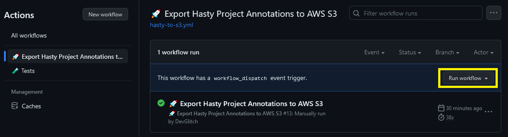

# HastyAnnotationsExportToAmazonS3
Tool that helps you export your annotations from Hasty.ai to Amazon S3 on demand and/or on schedule.
It uses GitHub Actions to run the export script which makes it easy to set up and run automatically.

## How to use

### 1. Fork this repository
Fork this repository to your own GitHub account.
```
$ git clone https://github.com/DevGlitch/HastyAnnotationsExportToAmazonS3.git
```

### 2. Create new GitHub secrets and configuration variables
You will need to create your own GitHub secrets and configuration variables. These are used to authenticate with Hasty.ai and Amazon S3.
```
# Secrets:
  - HASTY_API_KEY: The API key for your Hasty.ai workspace account.
  - AWS_ACCESS_KEY_ID: The access key ID for your Amazon S3 account.
  - AWS_SECRET_ACCESS_KEY: The secret access key for your Amazon S3 account.
  - AWS_S3_BUCKET_NAME: The name of the Amazon S3 bucket you want to export to.
  - AWS_S3_BUCKET_REGION: The region of the Amazon S3 bucket given above.

# Configuration variables:
  - HASTY_PROJECT_NAME: The name of your Hasty.ai project.
```

If you don't know how to create secrets and configuration variables, please see the links below.
- Create encrypted secrets for your repository:
https://docs.github.com/en/actions/security-guides/encrypted-secrets#creating-encrypted-secrets-for-a-repository
- Create configuration variables for your repository:
https://docs.github.com/en/actions/learn-github-actions/variables#creating-configuration-variables-for-a-repository

### 3. Adapt the workflow settings to your needs
You can adapt the workflow settings to your needs. 
For example, you can turn on the schedule ability by simply uncommenting the following lines in the workflow file:
```
#  schedule:
#    - cron: "0 6 1 * *"  # Run at 6am UTC (=2am ET) on the 1st day of each month
```
Also, feel free to change the date and time of the schedule to your liking.
It uses cron syntax. You can use this website to help you generate the cron expression: https://crontab.guru/

### 4. Run the workflow
You can run the workflow manually by clicking the "Run workflow" button in the Actions tab of your repository.
You can also wait for the workflow to run automatically according to the schedule you set up in step 3.

<p align="center">
    
</p>

### 5. Check the workflow run results
You can check the results of the workflow run in the Actions tab of your repository. 
- If the workflow run was successful, you should see a green checkmark ✔️ next to the workflow name. 
- If the workflow run failed, you should see a red cross ❌ next to the workflow name.
You can click on the workflow name to see the details of the run and the error message.

### 6. Check your Amazon S3 bucket
You can check your Amazon S3 bucket to see if the annotations were exported successfully.
If the workflow run was successful, you should see a new file in your Amazon S3 bucket.

### Optional:

#### - Turn on notifications
You can turn on notifications for your workflow runs. This will allow you to get notified when the workflow run fails.
To turn on notifications, click on the "Turn on notifications" button in the Actions tab of your repository.

#### - Duplicate the workflow for multiple projects
You can duplicate the workflow for multiple projects.
To do this, simply copy the workflow file and rename it to something like "hasty-export-annotations-project2.yml".
Then, you can adapt the workflow settings and configuration variables to your needs.

### Notes
- The AWS permissions policy to your S3 bucket should include PutObject and PutObjectACL.
- Make sure to turn versioning on for your Amazon S3 bucket. This will allow you to keep track of all the exported annotations.
- The Hasty project name is not set as a secret in order to make it easier to know which project is being exported.
Especially useful if you are duplicating the workflow for multiple projects.

## How to contribute
If you like this project, please consider giving it a ⭐.
You are welcome to contribute to this project by submitting a pull request.
If you have any suggestions or problems, please open an issue.
Thank you!


Making a difference, one line of code at a time...